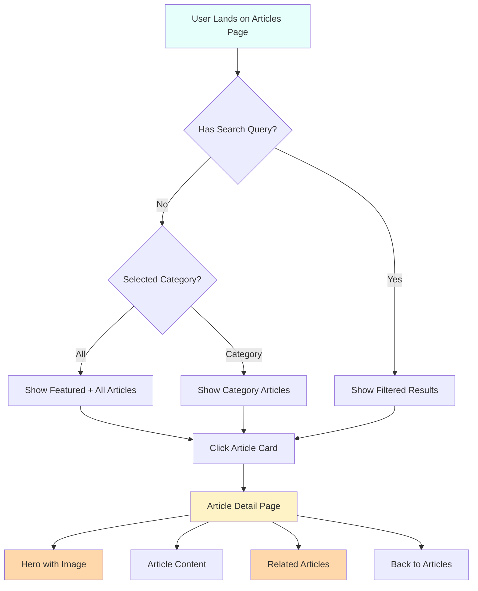

# Articles Page Redesign Plan

## Executive Summary

Redesign both the **Articles Listing Page** (`/articles`) and **Article Detail Pages** (individual article views like `/patience`, `/presence`, etc.) to create a more engaging, modern reading experience with better navigation, metadata, and visual hierarchy.

---

## Current State Analysis

### Articles Listing Page (`Articles.jsx`)

- ✅ Hero section with title and subtitle
- ✅ Search and category filter functionality
- ✅ Featured article section
- ✅ Grid of article cards
- ✅ Newsletter subscription section
- ❌ Missing: reading time, author info, social sharing, related articles
- ❌ Card design could be more engaging

### Article Detail Pages (e.g., `Patience.jsx`)

- ✅ Basic content rendering
- ❌ No hero image
- ❌ No article metadata (date, author, reading time)
- ❌ No navigation (breadcrumb, back button)
- ❌ Poor typography and content styling
- ❌ No social sharing
- ❌ No related articles
- ❌ No table of contents

---

## Redesign Goals

1. **Enhanced Articles Listing Page** - More engaging card design, better filtering, reading time indicators
2. **Professional Article Detail Template** - Hero images, proper typography, metadata, navigation
3. **Consistent User Experience** - Smooth transitions between listing and detail views
4. **Improved Readability** - Better typography, spacing, and content organization

---

## Implementation Plan

### Phase 1: Articles Listing Page Enhancements

#### 1.1 Enhanced Hero Section

- Add animated background elements
- Include a brief description/welcome message
- Add scroll indicator

#### 1.2 Improved Article Cards

- Add **reading time** estimate (calculated from content length)
- Add **category badge** with color coding
- Add **author name** (default: "Olusola Oladeni")
- Add **publish date** display
- Add **hover effects** with image zoom and overlay
- Add **social share on hover** (optional)

#### 1.3 Featured Articles Section

- Add "Most Popular" tab alongside "Featured"
- Show article view counts (mock data)
- Add "Trending" category

#### 1.4 Filter Improvements

- Add "Recent" and "Popular" sort options
- Add animated transitions when filtering

---

### Phase 2: Article Detail Page Template

#### 2.1 New ArticleDetail Component

Create a reusable `ArticleDetail.jsx` component that includes:

**Hero Section:**

- Full-width hero image from article
- Gradient overlay for text readability
- Article title (large, prominent)
- Category badge
- Author avatar and name
- Publish date
- Reading time estimate

**Content Area:**

- Clean, readable typography
- Proper heading hierarchy (h1, h2, h3)
- Styled blockquotes
- Image support with captions
- Proper paragraph spacing

**Navigation:**

- Breadcrumb: Home > Articles > [Article Title]
- "Back to Articles" floating button
- Previous/Next article navigation (optional)

**Engagement:**

- Social sharing buttons (Facebook, Twitter, WhatsApp, Copy Link)
- "Related Articles" section at bottom
- Newsletter signup inline

**Footer:**

- Author bio section
- "More from this category" links

---

### Phase 3: Supporting Updates

#### 3.1 Data Enhancements

Update `CardDataArticles.jsx` to include:

- `author`: Author name
- `date`: Publication date
- `readTime`: Estimated reading time in minutes

#### 3.2 CSS Updates

- Add new design tokens for article-specific styling
- Create responsive styles for new components
- Add animations and transitions

#### 3.3 Router Updates (if needed)

- Ensure all article links route to new detail component
- Consider dynamic routing: `/articles/:slug`

---

## File Changes Required

### New Files

1. `src/components/ArticleDetail.jsx` - New article detail template
2. `src/components/ArticleDetail.css` - Styles for detail page
3. `src/components/ArticleCard.jsx` - Enhanced article card component (optional)

### Modified Files

1. `src/pages/Articles.jsx` - Enhanced listing page
2. `src/pages/Articles.css` - Updated styles
3. `src/utils/CardDataArticles.jsx` - Enhanced data with metadata
4. `src/App.js` - Router updates (if using dynamic routing)

### Article Detail Pages to Update (or redirect to new template)

- `src/utils/Patience.jsx`
- `src/utils/Presence.jsx`
- `src/utils/Purpose.jsx`
- `src/utils/Triple.jsx`
- `src/utils/Worth.jsx`
- `src/utils/Danger.jsx`
- `src/utils/Leader.jsx`
- `src/utils/Blessed.jsx`
- `src/utils/winning.jsx`

---

## Design Specifications

### Color Scheme (60-30-10 Rule)

- **60% Dominant**: White/Light backgrounds (`#f7fafc`, `#ffffff`)
- **30% Secondary**: Deep Navy (`#1a202c`, `#2d3748`)
- **10% Accent**: Green (`#15803d`) + Amber (`#f59e0b`)

### Typography

- **Headings**: Bold, 1.2 line-height
- **Body**: 1.7 line-height, 1.1rem base size
- **Meta text**: 0.875rem, muted colors

### Responsive Breakpoints

- Mobile: < 768px
- Tablet: 768px - 992px
- Desktop: 992px - 1200px
- Large Desktop: > 1200px

---

## Mermaid: Current vs Redesigned Flow

---

## Acceptance Criteria

### Articles Listing Page

- [ ] Hero section displays with animation
- [ ] Search filters articles in real-time
- [ ] Category tabs filter correctly
- [ ] Article cards show: image, title, excerpt, category, reading time
- [ ] Featured article displays prominently
- [ ] Newsletter section is functional
- [ ] Responsive on all screen sizes

### Article Detail Page

- [ ] Hero image displays with gradient overlay
- [ ] Article title is prominent and readable
- [ ] Category, author, date, reading time displayed
- [ ] Content is readable with proper typography
- [ ] Breadcrumb navigation works
- [ ] "Back to Articles" button functional
- [ ] Related articles section shows relevant content
- [ ] Social sharing buttons present
- [ ] Responsive on all screen sizes

---

## Timeline Estimate

- Phase 1: Articles Listing Enhancements - 2-3 implementation steps
- Phase 2: Article Detail Template - 2-3 implementation steps
- Phase 3: Data & CSS Updates - 1-2 implementation steps

Total: 5-8 implementation steps (depending on complexity)
