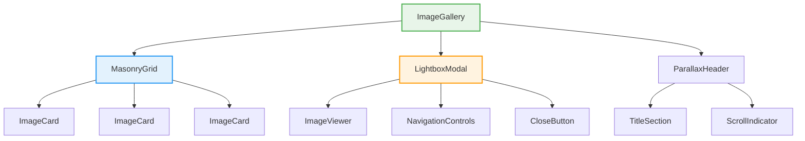
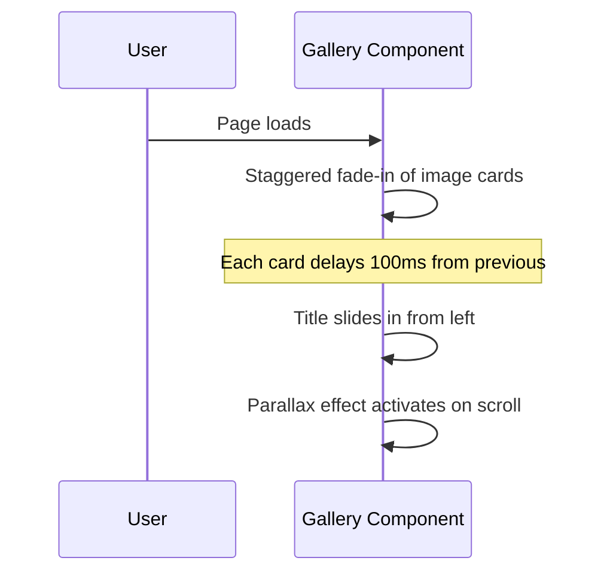
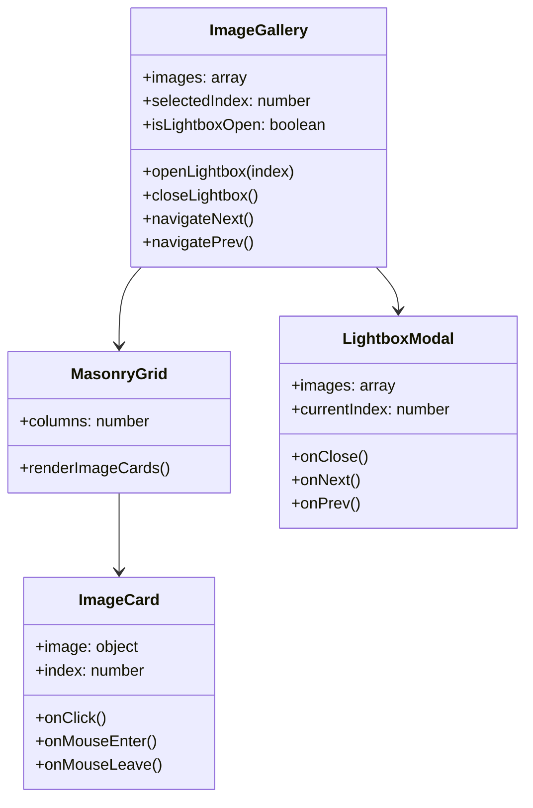

# Premarital and Marital Matters Gallery Enhancement Plan

## Current State Analysis

### Existing ImageCarousel Component
- **Location**: `src/utils/ImageCarousel.jsx`
- **Library**: react-slick carousel
- **Current Features**:
  - Center mode with 3 slides visible
  - Autoplay at 7-second intervals
  - Responsive breakpoints (768px, 480px)
  - Simple image display with object-cover
  - Gradient background (green-800 to purple-800)

### Currently Used Images
```javascript
// Premarital images
p1.webp  (1.3MB)
p2.webp  (1.1MB)
p3.webp  (1.5MB)
p4.webp  (1.3MB)

// February/Event images
feb1.jpg  (7.9MB) - largest, needs optimization
feb3.jpg  (5.9MB) - large, needs optimization
feb4.jpg  (7.2MB) - large, needs optimization
```

### Project Technology Stack
- React 18
- Chakra UI
- Framer Motion (available for animations)
- Tailwind CSS
- react-slick (current carousel)

---

## Proposed Gallery Architecture

### Mermaid Diagram: Component Structure



---

## Feature Specifications

### 1. Masonry Grid Layout
**Purpose**: Display images in an organic, visually appealing grid that adapts to different image aspect ratios

**Specifications**:
- Column count: 2 (mobile), 3 (tablet), 4 (desktop)
- Gap: 16px
- Image aspect ratios preserved
- Lazy loading for performance

**Implementation Options**:
- Option A: CSS Grid with `grid-auto-rows` (lightweight, no extra deps)
- Option B: react-masonry-css (proven library)
- Option C: Custom Framer Motion masonry with layout animations

**Recommendation**: Option C using Framer Motion for smooth layout animations

### 2. Lightbox Modal
**Purpose**: Allow users to view images in full-screen mode with navigation

**Specifications**:
- Full viewport overlay with dark background (rgba(0,0,0,0.95))
- Image centered with max-width/max-height constraints
- Previous/Next navigation arrows
- Close button (top-right corner)
- Keyboard navigation support (Escape to close, Arrow keys to navigate)
- Swipe support for mobile
- Image counter (e.g., "3 / 7")

**Animation**:
- Framer Motion `AnimatePresence` for smooth enter/exit
- Scale animation from thumbnail to fullsize
- Backdrop fade animation

### 3. Parallax Scrolling Header
**Purpose**: Add depth and visual interest to the gallery header

**Specifications**:
- Title section with "Premarital and Marital Matters"
- Background image with parallax effect (slower scroll speed)
- Scroll indicator at bottom

**Implementation**:
- Use Framer Motion `useScroll` and `useTransform`
- Parallax factor: 0.3-0.5 (30-50% of scroll speed)

---

## Animation Design

### Gallery Entry Animations


### Image Hover Effects
- Scale: 1.02 on hover
- Brightness: 1.05 on hover
- Transition: 0.3s ease-out
- Subtle shadow elevation

### Lightbox Transitions
- **Open**: Thumbnail position → Fullscreen position (layoutId animation)
- **Close**: Reverse of open animation
- **Navigate**: Crossfade with slight slide

---

## Responsive Design Specifications

### Mobile (< 640px)
- 2 columns masonry
- Lightbox: Full-width image, swipe navigation
- Tap to open lightbox

### Tablet (640px - 1024px)
- 3 columns masonry
- Lightbox: Navigation buttons visible
- Hover states enabled

### Desktop (> 1024px)
- 4 columns masonry
- Lightbox: Navigation + keyboard support
- Cursor changes to indicate interactivity

---

## Component Structure



---

## Implementation Roadmap

### Phase 1: Core Structure (Code Mode)
1. Replace `ImageCarousel.jsx` with new `ImageGallery.jsx` component
2. Implement masonry grid using CSS Grid + Framer Motion
3. Add responsive column adjustments

### Phase 2: Lightbox Feature (Code Mode)
1. Create `LightboxModal` component
2. Implement open/close animations with Framer Motion
3. Add navigation controls
4. Implement keyboard support

### Phase 3: Parallax Header (Code Mode)
1. Add parallax scrolling to title section
2. Implement scroll indicator animation

### Phase 4: Polish (Code Mode)
1. Add hover effects to image cards
2. Optimize large images (feb1, feb3, feb4)
3. Test responsive behavior

---

## Key Technical Decisions

### Why Framer Motion?
- Already installed in project
- Excellent for layout animations (shared element transitions)
- Supports spring physics for natural feel
- Great performance optimizations

### Image Optimization Notes
The images `feb1.jpg` (7.9MB), `feb3.jpg` (5.9MB), and `feb4.jpg` (7.2MB) are very large and should be:
- Converted to WebP format
- Compressed for web use
- Lazy loaded to improve initial load time

### Alternative Libraries Considered
| Library | Pros | Cons |
|---------|------|------|
| yet-another-react-lightbox | Full-featured, accessible | Extra dependency |
| react-masonry-css | Simple, proven | Less animation control |
| react-responsive-masonry | Good responsive support | Limited animations |

---

## Expected Outcomes

1. **Visual Appeal**: Modern masonry layout vs basic carousel
2. **User Experience**: Interactive lightbox for detailed viewing
3. **Engagement**: Parallax effects add polish and professionalism
4. **Performance**: Optimized images and lazy loading
5. **Responsiveness**: Seamless experience across all devices